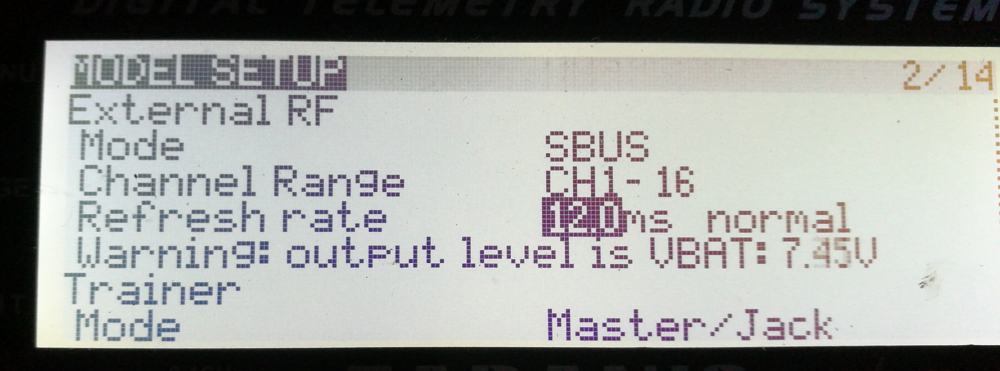
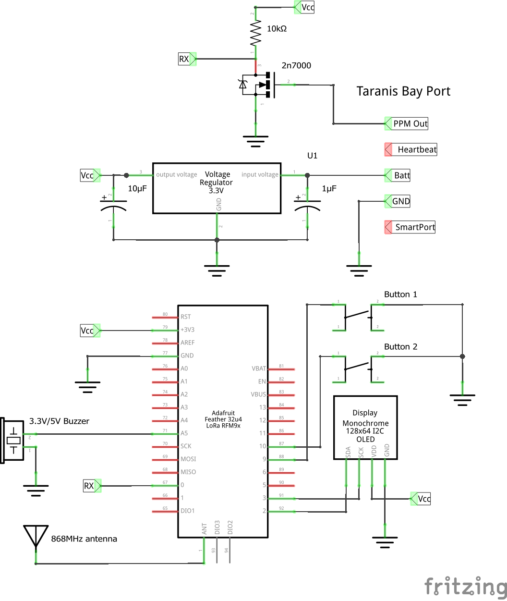
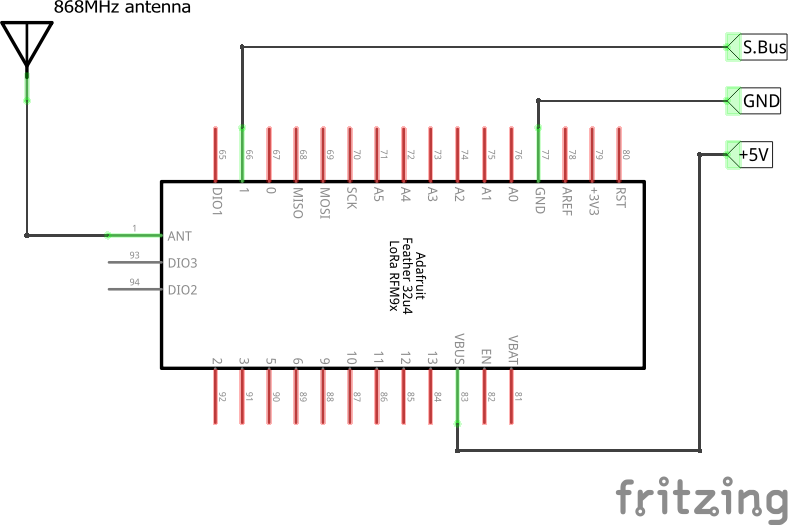

# QuadMeUp Crossbow

_QuadMeUp Crossbow_ is a DIY project that gives 5km (at least) of RC link for UAV (airplanes and drones) for a price below $40. I uses SX1278 (LoRa 868MHz/915MHz) compatible (like HopeRF RFM95W) radio modules connected to Arduino compatible boards. It can be regular Arduino connected via SPI to SX1278 or dedicated board like _Adafruit Feather 32u4 RFM LoRa_ or _LoRa32u4 II_

# Current state

Works:
* Getting data from OpenTX radio using SBUS protocol
* Transmitting 10 channels to RX modules
* Frequency hopping
* Getting basic telemetry from RX module
* Sending 10 channels using SBUS to flight controller

Needs implementation:
* Binding
* TX module configuration
* Allowing to use OLED on TX to get basic data
* RX configuration from TX module
* Sending telemetry from TX to OpenTX radio

# Dependencies

To compile, following libraries have to be installed:

* [U8g2](https://github.com/olikraus/u8g2) for OLED support in TX module

# Protocol

| Byte                  | Description | Notes |
| ----                  | ----        | ---- |
| 1                     | Frame type & used radio channel | bits 7-5 defines frame, bits 4-0 current radio channel |
| 2 - 33                | Payload | lenghth defined by frame type |
| payload length + 2    | CRC | using crc8_dvb_s2 method |

## CRC

CRC is computed using `crc8_dvb_s2` method. Initial CRC value for each frame CRC is equal to CRC of 4 bind bytes (unique for transmitter module). 

## Frame types

| Value  | Value hex    | Description                      | Direction  | Payload length |
| ----   | ----         |----                              | ---- | ----            |
| 0000   | 0x0          | RC channels data `RC_DATA` | TX -> RX | 9 |
| 0001   | 0x1          | Receiver health and basic telemetry `RX_HEALTH` | RX -> TX | 6 |
| 0010   | 0x2          | Request receiver configuration | TX -> RX | no used |
| 0011   | 0x3          | Receiver configuration | RX -> TX | no used |
| 0100   | 0x4          | Set receiver configuration | TX -> RX | no used |
| 0101   | 0x5          | PING frame, uses 9 byte payload | TX -> RX | 4    |
| 0110   | 0x6          | PONG frame, the same payload as PING | RX -> TX | 4 |
| 0111   | 0x7          | `BIND` frame, transmitted by TX only during binding | TX -> RX | 4 |

### `RC_DATA` frame format

Protocol allows to send 10 RC channels in total encoded as following

* channels 1 to 4 encoded using 10 bits each (5 bytes)
* channels 5 to 6 encoded using 8 bits each (2 bytes)
* channels 7 to 10 encoded using 4 bits per channel (2 bytes)

Total length of `RC_DATA` payload is 9 bytes

### `RX_HEALTH` frame format

| Byte  | Description                           |
| ----  | ----                                  |
| 1     | RX RSSI                               |
| 2     | RX SNR                                |   
| 3     | RX supply volatage, sent in 0,1V      |
| 4     | RX analog input 1 sent in 0,1V        |
| 5     | RX analog input 2 sent in 0,1V        |
| 6     | Flags                                 |

#### Flags

| Bit   | Meaning                               |
| ----  | ----                                  |
| 00000001  | Device in Failsafe mode           |

### `PING` and `PONG` frames

`PING` and `PONG` frames are to determine packet roundrip between **TX** and **RX** module.
**TX** sends `PING` frame with curent `micros`. If **RX** receives `PING` frame, it respons
its payload as `PONG` frame. 

### `BIND` frame format

| Byte  | Description                           |
| ----  | ----                                  |
| 1     | Bind key byte 0                       |
| 2     | Bind key byte 1                       |
| 3     | Bind key byte 2                       |
| 4     | Bind key byte 3                       |

# RSSI

1. Receiver RSSI for the last received packet is injected as channel 11
1. RSSI is scaled in **dB**, NOT **percent**
1. RSSI 0 in flight controller means 40dB RSSI in RF chip on last packet received  
1. RSSI 100 in flight controller means 140dB RSSI in RF chip on last packet received
1. Rule of thumb: to increase distance twice you need 6dB assuming nothing else will interfere
1. If at 100m RSSI is 40, at 200m should be around 34
1. I had successful flight with RSSI below `15`
1. With correct antennas, at 1km RSSI should be around `20` 

# OpenTX setup

OpenTX 2.2.1 or newer is required with enabled **External RF** SBUS.

* Mode: `SBUS`
* Channel Range: `1-16`
* Refresh rate: `12.0ms` or `14.0ms` `normal`

Tested with:

* FrSky X9D Plus

# Flight controller setup

RX module outputs RC data using SBUS protocol. The trick is that DIY RX module does not have inverters, so SBUS signal is also not inverted (TTL standard), while standard SBUS protocol used inverted serial signal.

That mean the following:

* RX module TX line can be connected to any free UART RX pin
* On F3 or F7 boards flight controller has to be configured not to use inverted SBUS (refer to flight controller docs)
* On F4 flight controllers inverios has to be configured only when using dedicated SBUS serial port 

# Manual

## Binding

After flashing TX and RX, binding is required. 

1. Power up TX module
1. Navigate using button #1 to "Bind" option
1. Long press button #2 to enter _Bind Mode_
1. Power up RX
1. RX LED flashes quickly when in bind mode
1. After RX receives bind packet, LED goes to constanly _ON_ state
1. When RX LED is solid _ON_, leave bind mode by long pressing button #2 

# TX module connection diagram

# RX module connection diagram

